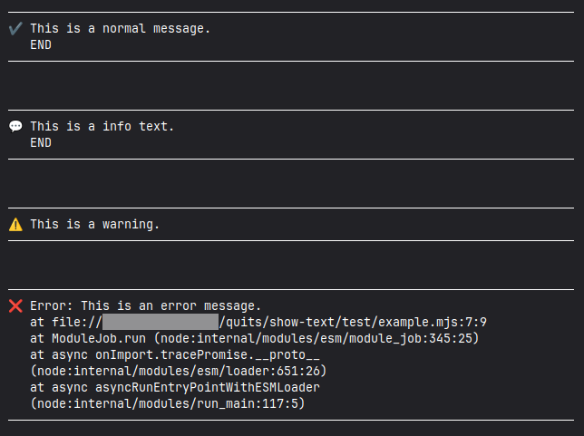

# @quitsmx/show-text

Displays multiline text in the console, with icon and word wrap.

Make your messages more visible and offer a less crude alternative to a simple "throw"...

## Requirements

Node.js 18.18.0 or above.

Should work with Bun 1.2.23 and Deno 2.5.2, although I don't use them.

Does **not works** in browsers.

## Install

With your favorite package manager, for example:

```bash
pnpm add @quitsmx/show-text
```

## API

There are 4 functions, all of which accept one or more blocks of text:

| Function        | Icon | Use             |
| --------------- | :--: | --------------- |
| `showText`      |  ✔️  | `console.log`   |
| `showInfoText`  |  💡  | `console.info`  |
| `showWarnText`  |  ⚠️  | `console.warn`  |
| `showErrorText` |  ❌  | `console.error` |

## Example

This example shows basic usage in an 88-column console...

```js
import { showErrorText, showInfoText, showText, showWarnText } from '@quitsmx/show-text'

try {
  showText('This is a normal message.', 'END')
  showInfoText('This is a info text.\n END')
  showWarnText('This is a warning.')
  throw new Error('This is an error message.')
} catch (error) {
  showErrorText(error)
  process.exitCode = 1
}
```

Output:



## License

The [MIT License](LICENSE) © 2025-Present by QuITS
